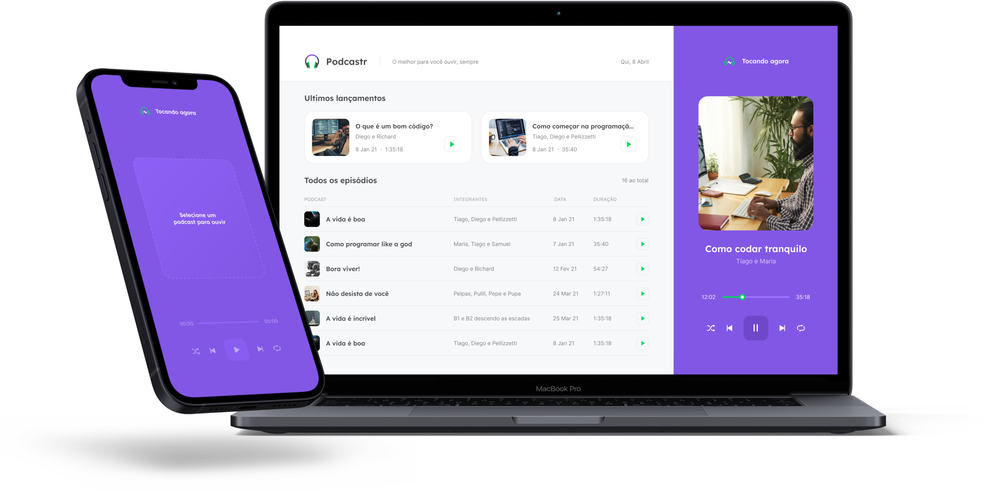

<h1 align="center">
  
</h1>

<p align="center">
  <a href="https://www.linkedin.com/in/eliasgcf/"></a>
  
</p>

<p align="center">
  <a href="#-layout">Layout</a> •
  <a href="#-technologies">Technologies</a> •
  <a href="#-getting-started">Getting started</a> •
  <a href="#-license">License</a>
</p>

<p align="center">
  
</p>

## 🔖 Layout

You can view the project layout through the link below:

- [Podcast Layout](https://www.figma.com/file/UwFEntsHpHYJlHNQAQr4gA/?node-id=160%3A2761)

Remembering that you need to have a [Figma](http://figma.com/) account to access it.

## 🚀 Technologies

- [ReactJS](https://reactjs.org/)
- [TypeScript](https://www.typescriptlang.org/)
- [Sass](https://sass-lang.com/)
- [Next.js](https://nextjs.org/)

## 💻 Getting started

### Requirements

- [Node.js](https://nodejs.org/en/)
- [Yarn](https://classic.yarnpkg.com/) or [npm](https://www.npmjs.com/package/npm)

**Clone the project and access the folder**

```bash
git clone https://github.com/EliasGcf/podcastr.git && cd podcastr
```

**Follow the steps below**

```bash
# Install the dependencies
yarn

# Run JSON Server to simulate the REST API
yarn server

# Start the application
yarn dev
```

## 📝 License

This project is licensed under the MIT License - see the [LICENSE](LICENSE) file for details.

---

<p align="center">
  Made with 💜&nbsp; by <a href="https://www.linkedin.com/in/eliasgcf/">Elias Gabriel</a>
</p>
